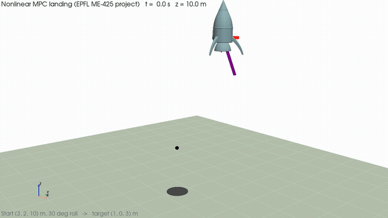

# Rocket landing with model predictive control

EPFL ME-425 Model Predictive Control, mini-project, autumn 2025. Amir Lahlou and Ilyas Asmouki.



The rocket is a 12-state thrust-vector-controlled model (angular rates, attitude, velocities, position) with four inputs (two gimbal angles, average throttle, differential throttle). The project goes from linear MPC on the decomposed subsystems to a nonlinear MPC that lands the full model.

## What is in here

| Folder | Content |
|---|---|
| `Deliverable_3_1` to `Deliverable_3_3` | Linear MPC on the four decoupled subsystems (x, y, z, roll): terminal cost from the DARE, terminal invariant sets, regulation and tracking |
| `Deliverable_4_1` | Tracking with references |
| `Deliverable_5_1`, `Deliverable_5_2` | Offset-free MPC with a disturbance observer (model mismatch on mass) |
| `Deliverable_6_1&2` | Robust and tube MPC, landing with the linear controllers |
| `Deliverable_7` | Nonlinear MPC on the full model (CasADi), the controller shown in the animation |
| `report/` | Final report (PDF and LaTeX source) with all figures |
| `src/`, `Cartoon_rocket.obj`, `rocket.yaml` | Rocket simulator and 3D visualizer provided by the course teaching team (PREDICT-EPFL) |
| `LinearMPC_template`, `LandMPC_template`, `PIControl` | Course templates and baseline PI controller |
| `media/` | Landing animation and the script that renders it off-screen with PyVista |

## Run

```bash
python -m venv .venv && source .venv/bin/activate
pip install -r requirements.txt
jupyter lab
```

Open a deliverable notebook and run it top to bottom. To re-render the landing video without a notebook:

```bash
MPCPROJ=$(pwd) OUTDIR=media python media/render_landing.py
```

(`render_landing.py` reloads a saved trajectory; run `Deliverable_7/Deliverable_7_1.ipynb` first to generate it, or adapt the script to call `rocket.simulate_land` directly.)

## Credits

The rocket model, simulator, 3D visualizer and exercise templates come from the EPFL MPC course (PREDICT-EPFL). The controllers, notebooks, report and animation script are ours.
